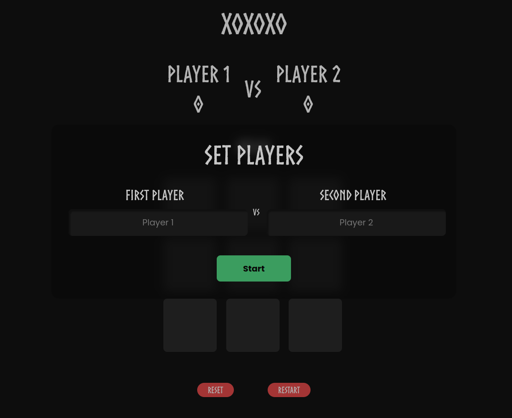
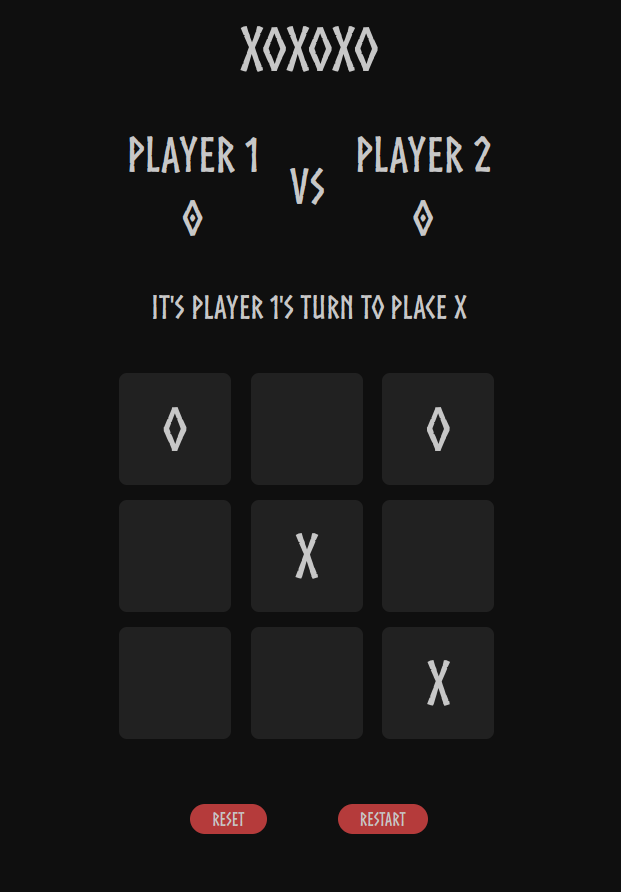

# <a href="https://a07k.github.io/Project-Tic-Tac-Toe/">Tic-Tac-Toe Game</a>

  <h2>Description</h2>
    
This project is a simple, interactive Tic-Tac-Toe game implemented using HTML, CSS, and JavaScript. It allows two players to compete against each other on a 3x3 grid.

  <h2>Features</h2>
    <ul>
        <li>Two-player gameplay</li>
        <li>Player name input</li>
        <li>Real-time score tracking</li>
        <li>Game status messages</li>
        <li>Reset and restart game options</li>
    </ul>
    <h2>How to Play</h2>
    <ol>
        <li>Open the game in a web browser</li>
        <li>Enter names for Player 1 (X) and Player 2 (O)</li>
        <li>Click the start button to begin the game</li>
        <li>Players take turns clicking on empty cells to place their symbol (X or O)</li>
        <li>The game ends when a player wins by getting three in a row, or when the board is full (a draw)</li>
        <li>Use the restart button to play another round or the reset button to start a new game with different players</li>
    </ol>
    <h2>Technical Details</h2>
    <ul>
        <li>The game board is represented as a 3x3 array in JavaScript</li>
        <li>Event listeners are used to handle player moves and button clicks</li>
        <li>The game checks for a winner after each move using predefined winning patterns</li>
        <li>DOM manipulation is used to update the game board, scores, and messages</li>
    </ul>

  <h2>Future Improvements</h2>
    <ul>
        <li>Add an AI opponent for single-player mode</li>
        <li>Implement local storage to save game states and high scores</li>
        <li>Add animations for a more engaging user experience</li>
        <li>Create a responsive design for better mobile gameplay</li>
    </ul>
